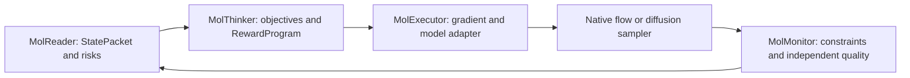

# Live execution and model adapters

MolThinker defaults to `molthinker-reward-creativity`. `--mode selection` selects the preserved reference-selection workflow. The unsuffixed skill is a compatibility router. Both workflows have English and Chinese instructions, with no implementation or release history embedded in the skill text.

The skills guide an agent's reasoning. The deterministic composer currently compiles a bounded family of molecular rewards; it is not a general symbolic discovery system or an external LLM service. Additional observables require an explicit differentiable primitive and applicability checks.

## Module boundaries



- `interfaces.py`: `SamplingAdapter`, `CallbackAdapter`, `guided_step`, editable masks and per-atom injection budgets. This layer does not assume a FLOWR timestep or a particular noise schedule.
- `program.py`: differentiable reward primitives and compositions. Graph identity is detached; reference lookup does not pretend to be differentiable.
- `flowr.py`: model loading, dataset preparation, native endpoint prediction, forward-time injection, prefix replay and complete runtime checkpoint restoration.
- `engine.py`: the FLOWR continuation loop, same-time proposal checks, native sampling, detached self-conditioning and event traces.
- `runner.py`: explicit adapter registry, configuration validation, gradient preflight and generated `run_guidance.py` entrypoint.
- `molmonitor/live_gradient.py` and `evaluate_generation.py`: live derivative checks and independent evidence collection.

## Connecting another sampler

The minimal integration surface is `guided_step`. Supply:

1. `CallbackAdapter.endpoint(x)`: a differentiable endpoint/denoised prediction in declared coordinates.
2. `pullback_multiplier(step_size)`: the sampler's mathematically appropriate injection factor. Positive forward-flow `dt` and reverse-diffusion covariance are distinct conventions.
3. `native_step(x)`: the untouched model update, including its random draws and schedule.
4. A scalar reward, explicit editable mask, accumulated injected path, budget and proposal validator.

The return value is next coordinates, updated path budget and a monitor record. A rejected proposal returns the native update exactly. Model weights should be frozen, while input coordinates require gradients. Detach state and self-conditioning between steps to prevent backpropagation through the whole sampling history.

```python
from molsteer.molexecutor import CallbackAdapter, GuidanceBudget, guided_step

adapter = CallbackAdapter(
    endpoint=lambda x: model_endpoint(x, current_time, detached_condition),
    pullback_multiplier=lambda step: sampler_guidance_factor(step),
)
next_x, used_path, monitor = guided_step(
    adapter, current_x, scalar_reward, native_step, step_size,
    editable_mask, used_path, GuidanceBudget(), proposal_validator,
    coord_scale=model_to_angstrom,
)
```

The named model/sampler callbacks are supplied by the integration, not inferred from a checkpoint. `proposal_validator` must implement the task's noncompensable checks.

A model-specific runner owns preprocessing, persistence, decoding and categorical updates. Register a runner adapter explicitly for automation. FLOWR is the only production-model adapter exercised here; the diffusion covariance convention is tested on a small numerical sampler, not a second pretrained diffusion model.

## FLOWR injection

For the inspected linear FLOWR sampler:

\[
X_{t+\Delta t}^{\mathrm{proposal}}=\operatorname{NativeStep}(X_t,\hat X_1,t,\Delta t)
+\Delta t\,\eta\,\nabla_{X_t}R(\hat X_1(X_t,t),G).
\]

The native integrator retains its `(predicted-current)/(1-t)` velocity, coordinate noise and discrete sampling. The added gradient is **not** divided by `1-t` a second time. The Jacobian is obtained through the actual model forward pass. Only the selected batch item's coordinates receive the added displacement. The other batch items retain native updates and the original random-draw layout.

Per-step candidate checks compare the proposed and native endpoints at the same next time and with identical self-conditioning. They reject invalid/disconnected graphs, new or worsened severe overlaps, excessive endpoint movement and reward regression. Up to four shrinking proposals are checked. Unsupported chemistry/reference coverage suspends the extra guidance for that step. These guards constrain added guidance; they do not guarantee that the native generator or terminal molecule passes every quality criterion.

All target atoms are editable in the supplied experiment. The generic interface supports fixed masks. This FLOWR resume recipe explicitly rejects its separate inpainting modes until a mask-aware preprocessing/restoration adapter is supplied.

## Reward contract

Selection reproduces the supplied squared interval penalties with frozen initial template bounds, unit weights and 1 Å distance scales. Its two endpoint terms are not added to raw-state penalties. Fixed bounds intentionally preserve the literal legacy ablation, and become chemically questionable after a graph change; the trace records graph changes.

Creativity uses the requested log-mean-exp balance, auxiliary sum and fixed-marginal graph preference. The common objective set is geometry, clashes, centroid retention and movement. Geometry groups bonds and angles within the evidence-selected region, uses a joint pseudo-Huber residual, and rebinds references to the current valid graph. MMFF parameter queries provide references; parameter availability is not a physical validation. See [RDKit parameter queries](https://www.rdkit.org/docs/source/rdkit.ForceField.rdForceField.html).

`C_G` uses the **original supplied** prediction probabilities, not probabilities recomputed at each generation step. It is constant with respect to coordinates within a discrete branch. It affects proposal ranking/acceptance across graph changes and is never assigned a fictitious straight-through derivative. Formal charge remains a categorical identity, not a partial charge.

Residual force-field strain and directed contact rewards are deferred: no valid residual-energy decomposition or designated favorable contacts were supplied. Centroid retention is only a pose-preservation cost. Model affinity heads and unconstrained descriptors are monitored, not silently optimized.

Experimental values: `tau=0.1`, `rho=0.05`, `lambda_graph=0.1`, objective weights 1; bond tolerance/scale 10% of its current reference, angle tolerance/scale 30°; clash and centroid scales 1 Å; movement scale 0.5 Å. Protein/intraligand clash radii factors are 0.75/0.70. Severe-overlap threshold is 0.4 Å. Endpoint trust radius is 1 Å from the supplied initial endpoint. Gradient strength is 1; per-atom injected step is capped at 0.02 Å and cumulative injected path at 0.5 Å. These are uncalibrated demonstration settings, not optimized hyperparameters. Cumulative injected path is not the same as total native molecular displacement.

## Restoration and numerical precision

Original `state.pt` snapshots omit self-conditioning and RNG. Prefix replay did not exactly reproduce the original state. The explicit experimental policy restores **every saved state tensor exactly**, while retaining the same replay-reconstructed context/RNG for all arms. The restored endpoint can differ from the historical endpoint, including its argmax graph. The report must retain this limitation. No exact historical continuation is claimed.

New checkpoints include native state, prior, self-conditioning, times, step index, CPU/CUDA/Python/NumPy RNG, source metadata, reward identity and cumulative guidance budget. Only tensors and primitive containers are serialized; restore uses `weights_only=True`. Runtime reconstruction still needs the receptor, reference ligand, original preprocessing recipe and checkpoint. Do not change these silently.

TF32-enabled exploratory inference failed small-perturbation derivative checks. The delivered live adapter defaults to highest float32 matrix precision and disables TF32. The preflight records several finite-difference scales, graph stability, sign and relative error, and stops execution if its declared screen fails. Autograd computes derivatives of the specified graph; a successful backward pass alone does not establish agreement with finite perturbations. See [PyTorch autograd](https://docs.pytorch.org/docs/stable/autograd.html).

## Automated execution

```bash
cd /data1/dhuang/flowr_root
.venv/bin/python -m molsteer think --mode creativity \
  --packet /path/StatePacket.json --report /path/DiagnosticReport.json \
  --knowledge /path/knowledge.md --output /path/creativity.json
.venv/bin/python -m molsteer.molexecutor.runner \
  --config MolSteer/experiments/guidance/execution.json --emit /path/new-job
.venv/bin/python /path/new-job/run_guidance.py
```

Choose a fresh output path. A continuation job can set `resume_checkpoint` to a saved runtime checkpoint and select its original arm. Keep its reward program unchanged. `start_step` defaults to 50 only for the supplied historical replay recipe. The independent evaluation entrypoint is `python -m molsteer.molmonitor.evaluate_generation --root RUN --config CONFIG`.

For example, `--resume /path/creativity/resume_t_0.75.pt --arm creativity --output /path/fresh-continuation` overrides the runtime checkpoint, arm and output while preserving the remaining configuration.

The original model repository files and original generation snapshots are not overwritten. Deployment updates the separate `MolSteer` package and emits new output directories.
