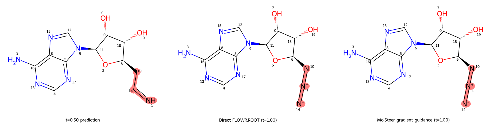

# 5i0b / ligand_002：图变化复核与 FLOWR.ROOT 梯度续推实测

日期：2026-09-30（Asia/Shanghai）。本页单独记录 `5i0b_A__5vef_M77 / ligand_002` 的 `t=0.50→1.00` 测试。远端为 `ksai.scnet.cn:10545` 的 SCNet Notebook，仓库 `/root/private_data/MolSteer`。本文不含 SSH 密码、API 密钥或模型私有推理文本。

## 测试定义与来源

使用 2026-09-29 在同一容器捕获的真实 FLOWR.ROOT v2.2 阶段：`flowr_root/output/scnet_5i0b_stage_20260929/5i0b_A__5vef_M77/ligand_002/t_0.50/runtime.pt`。它保存了第 50 步、模型、自条件和随机数状态；SHA-256 为 `c9a2409df784af2c98d6cd00158f929905a015967613580f0e2588914a2f05d6`。两支从此同一状态恢复，均运行到第 100 步；本次没有重新随机生成一个 `t=0.50` 起点。阶段脚本 SHA-256 为 `cd371012e995ccf6f8343e3e66fce430e924bf9a1652840457dea2c2268901e0`。

远端实测为 RTX 4090（24,564 MiB）、Python 3.12.14、PyTorch 2.5.1+cu121；FLOWR v2.2 权重、受体和配体输入均存在。MolSteer 优化代码先提交到 GitHub，再由远端 `git pull --ff-only origin main` 拉取，最终源码提交为 `64e30d4`；远端完整测试为 **207 passed**。保留远端原有未提交数据。开始时曾经通过归档传入源码做预检，正式运行前已恢复原文件并改用 GitHub 拉取后的提交。

## `t=0.50` 重新识别

`scripts/prepare_exact_experiment.py` 从该阶段重新生成 StatePacket `sp_a5662e7e4de6bb9f80da5f10`、DiagnosticReport 和确定性参考程序；Reader 索引 80 条证据，报告 1 个预测终点结构风险区域。重点为原子槽位 1、10、14：当前预测图中 N(1)–C(14)–C(10) 的局部几何与基于这张暂时假设图的 MMFF 参照有偏差。`t=0.50` 图仅是当时的类别预测，不是要求保留的化学结构。

API 单 Agent 使用当前配置和同一新诊断进行了真实设计尝试，结果为 `design_deferred`、`errors=[]`，**没有可执行的已验证 API 奖励**。它指出候选派生器没有提供直接角度 `[1,14,10]` 的软约束项；1–3 端点距离不能替代角度；硬约束与现有软距离原语的语义也不一致。因此 API 草稿没有送入 FLOWR 推理。路径双挂载（`/root/private_data` 与 `/public/home/daweihuang`）导致首次知识文件路径校验失败，改用后者的绝对路径后才执行该 API 设计。

为完成可执行链路测试，另行显式启用 **offline** Agent；其奖励检查点状态为 `validated`，不可称为 API Agent 的产物。初始程序 `rp_fa6350791b8c933e9624123d` 具有 4 项：prediction 视图上原子 1–10 的区间距离 `[1.7705, 3.0508] Å`、1–14 的区间距离 `[1.161, 1.419] Å`，均声明依赖化学图；state 视图上原子 3、1 对各自受体参考点的最小距离下限均为 `2.475 Å`，均声明为纯坐标项。四项权重各 1，`lambda_graph=0`。这是筛选性几何／近距奖励，没有独立亲和力证据，也没有补上 API 所要求的角度原语。

## 代码变化与试运行

提交 `f85d16e` 删除了 expert 的全图一致性检查，加入 MolMonitor 的图变化事件、MolReader 新图读取、MolThinker 奖励复核、MolExecutor 重新编译与实时梯度预检。保留原生槽位、RNG、自条件和累计位移预算；原子、形式电荷、键类别仍由 FLOWR 原生采样。候选若换图不会仅因“与 `t=0.50` 图不同”而拒绝；化学不可解码、严重碰撞或奖励回退仍可拒绝新增引导提议。若原生更新后的图改变，当前步先暂停额外引导，下一步复核后继续；原生采样不回滚。

代码中仍有 `same_graph` 字段，用于判断两次 MMFF 应变数值能否在同一化学图下直接比较；不同图会标记需要质量复核，而不会因这项比较被强制改回初始图。`agent_mixed` 本次程序的 `lambda_graph=0`，没有初始图类别偏好。

第一次配对试运行设置 `max_graph_reviews=4`。因为初始 Agent 程序含两个 **不依赖化学类别**的 state 最小距离项，旧触发逻辑仍把噪声态的每步类别波动送入复核，预算迅速耗尽：引导分支仅 3 步取得梯度、0 步接受。这个试运行只用于定位复核触发过宽的问题。随后提交 `64e30d4` 将 FLOWR 实时复核限定到奖励项声明的 `graph_dependent` 视图，远端拉取后定向测试 **13 passed**。若旧程序未声明依赖性，仍保守监测相关视图。

最终配对运行使用该修正和 `max_graph_reviews=20`。起点奖励及第 51 步自动重派生的奖励均通过实时有限差分预检。第 51 步预测图的 **原子 14 从 C(0) 改为 N(0)**，事件 `gc_e44eace29e388c528d94541f` 触发一次 Reader→Thinker→Executor 复核，得到新 StatePacket `sp_2cc7f9108a5bb3a93bfe61ed` 和数值已验证程序 `rp_af75395c5258868ce73e8331`。旧图条件下的两个 prediction 键长窗口被撤掉；新程序只保留两个 graph-independent 的 state 最小距离项。之后不再因为与这些纯坐标项无关的类别变化反复调用 Agent。编辑槽位仍受宿主原生槽位约束。

**对“复核”含义的追审：**上述运行的 Agent 配置是 `offline/single`。其 MolThinker 路径直接采用 `planner.derive` 从新报告自动生成的候选项，并未执行 API 模型的逐项目标审议；虽然图事件携带旧奖励，`derive` 不读取旧奖励或图变化反馈。远端审计检查点中的 `task_plan` 为 `not_provided`，`expert_history` 与 `research_packets` 均为空。新诊断仍有原子 `[1,10,14]` 的 `structural_screening` 和 `conformational_strain`，新 RewardSpec 将二者列入 `unhandled_findings`，而只保留两项受体近距约束。两条旧 prediction 距离窗口在 C→N 后不应未经重定界就沿用，但**自动删项并继续把新程序称为对原目标的充分重设计，不合理**。该次 `validated` 只表示新公式通过证据绑定、数值检查和在线导数预检，不能证明旧目标已解决、无需替代，或新奖励覆盖了原始诊断。因而本次结果应视为图事件触发及受限坐标目标续推的机制测试，不能作为完整化学角色复核的成功案例。合理的生产门禁应要求逐项记录保留／重定界／暂缓及证据；若关键图依赖目标缺乏可验证替代，应暂停相应引导并显式报告未解决目标，同时允许 FLOWR 原生采样继续。

这里的 `step=51` 是零起始循环编号，**不是** `t=0.50` 快照的第 51 个原子，也不是终态第 51 次修改。`step=50` 从 `t=0.50` 原生积分到 `t≈0.51`；随后 `step=51` 的引导前预测才观察到 C(14)→N(14)，对应 trace 的 `t=0.50999999`。两分支在保存的 step 50、51、52 的坐标、元素、电荷和键类别逐项相同，说明换图发生于任何已接受引导位移之前。原始 runtime 的模型文件 SHA-256 经加载校验；第 51 步复核快照与它指向同一模型文件，阶段脚本哈希、GPU 和精度也一致。复核快照是采样器内存状态的再保存，并没有载入第二套模型权重。原子 14 的预测概率从 `t=0.50` 的 `P(C)=0.569321, P(N)=0.384352`，变为 `t≈0.51` 的 `P(N)=0.829037, P(C)=0.102901`。因此本次观察没有检查点不一致的证据；它体现的是模型随时间更新的类别假设。

### 第 51 步的独立核查

针对“时间方向或模型 checkpoint 是否用错”的疑问，另从上述**原始** `runtime.pt` 单独恢复一次，不加载奖励、不求梯度、不注入位移：在 `t=0.50` 调用原生预测，执行一次 `model.integrator.step`，将时间加到 `0.50999999`，再调用原生预测。原子 14 的两次类别概率与阶段文件、图复核文件逐项相等（最大绝对差均为 `0.0`）：先是 `P(C)=0.569321, P(N)=0.384352`，后是 `P(N)=0.829037, P(C)=0.102901`。这直接复现了无引导时的 C→N **预测终态**变化。

FLOWR.ROOT 自身将 prior 作为 `t=0` 的噪声状态，以正步长积分至 `t=1`，最后还在 `t=1-10⁻⁴` 做一次预测校正；[模型论文的方法部分](https://arxiv.org/html/2510.02578v3#S4.SS2)也将初态写作噪声配体 `l₀`、目标写作 `l₁`。`stage_runner.py` 使用 `torch.linspace(0,1,101)`，在完成第 50 次积分、时间已到 `0.50` 后才写入该阶段的 `runtime.pt`。因此 `step=50` 是从这个快照出发的下一次更新，`step=51` 是对更新后 `t≈0.51` 状态的预测／复核。这里没有把扩散模型常用的反向时间约定误套到 FLOWR 上。

需要区分三个对象：`runtime.pt` 中的当前离散采样状态、模型每一步对最终类别给出的概率、由该概率取最大值绘出的临时 SDF 图。原生 `uniform-sample` 离散积分器会随机更新元素、电荷和键；在本次 `0.50→0.51` 更新中，采样状态的原子 14 实际从 **C 变为 F**，此外另一原子槽位、4 个电荷类别和 7 对键类别也发生变化。更新后的模型预测终态则将原子 14 从 C 判为 N；这并非引导代码把 C 直接改写为 N。当前权重的元素离散策略为 `uniform-sample`，`cat_noise_level=1`，`cat_noise_euler_guard=True`。在 `t=0.50` 的模型概率与原生采样公式下，原子 14 从当前 C 抽到 F 的单步概率约为 `0.00607`；小概率事件可以发生，不能由此推断 checkpoint 错配。此项观察说明原生离散采样参与了变化，但没有单独做反事实实验来分离 C→F、其他离散更新、自条件和时间前进各自的因果贡献。

更强的续推一致性检查是：无引导分支与原始完整生成在 `t=0.75` 和 `t=1.00` 的 `curr`、自条件 `cond` 与时间张量逐项最大绝对差均为 `0.0`，这两个阶段的 SDF 文件 SHA-256 也分别相同。原始 `runtime.pt` 记录的权重是 `flowr_root_v2.2.ckpt`，SHA-256 为 `b818f41dc12ffb6bc558bb0ad997055581e07cd9e49dcac1b794ed9993c46e4c`；恢复时重新校验了该文件内容。第 51 步的变化属于这条原始 FLOWR.ROOT 轨迹，不能归咎于梯度引导或切换权重。它也不证明最终 N 图优于 C 图；后者仍需独立的化学与靶标评价。

| 分支 | 续推步数 | 有梯度步数 | 接受引导步数 | 已验证图复核 | 最大累计注入路径 | 终态 FLOWR pKd head |
| --- | ---: | ---: | ---: | ---: | ---: | ---: |
| 无引导原生 FLOWR.ROOT | 50 | 0 | 0 | 0 | 0 Å | 5.42794323 |
| offline Agent + 图变化复核 | 50 | 44 | 41 | 1 | 0.00429059 Å | 5.42802334 |

两支终态 SDF 都通过 RDKit 解析和 sanitize，均为 20 个原子且连接图相同；坐标帧直接 RMSD 为约 `0.000378 Å`。模型内部 pKd head 差为 `+0.0000801`，远小于可据此宣称结合力改善的程度。终态 MolReader 两支均报告 1 个相同类别的 `structural_screening` 区域（槽位 1、10、14）；没有证据表明引导消除了该结构筛选警示。引导确实接入坐标续推，但此次位移很小，单例不证明分子质量或亲和力提高。

### 梯度引导的实际作用量

本次 offline Agent 的奖励是负的区间外平方罚：每项为 `-weight × 0.5 × [(max(lower-d,0)/scale)² + (max(d-upper,0)/scale)²]`，单边下限项省略上限。初始四项的 `weight=1`、`scale=1 Å`：预测终点的 1–10 与 1–14 距离窗口，以及当前采样状态中原子 3、1 与各自受体参考点的 `2.475 Å` 最小距离。`lambda_graph=0`。在 `t≈0.51` 复核后，两个依赖旧化学图的预测距离项被删除，仅保留两个 state 视图的受体近距项。程序没有直接奖励亲和力、目标键角、元素类别或最终图。

全局引导强度 `strength=1.0`，复核后的 `strength_cap=1.0`；每步实际候选位移为 `Δt × strength × ∇_{X_t}R`，其中 `Δt≈0.01`，然后受每原子 `0.02 Å/步` 与 `0.5 Å` 累计路径上限约束，并须通过同一下一时刻的候选检查。此次非零候选未触及位移上限。初始与图复核后的数值梯度预检均通过；后者 9 个抽查方向的最大相对误差约 `0.00047`。这只验证局部梯度计算，不等于验证奖励目标的药化意义。

重新逐行核对 trace 后，应把“41 步接受”拆开：44 步完成梯度计算，其中只有 **12 步梯度非零**；3 个早期非零提议未被接受，真正**非零注入只有 9 步**（循环 `step=59–67`）。其余 32 个“接受”是平底奖励已为零时的**零位移**，不能计作有效引导。最大单步接受位移的整配体 L2 范数为 `0.001472 Å`，发生于 `step=59`，只占该步原生位移的约 `1.05%`；最大单原子累计注入路径为 `0.004291 Å`。随后奖励区间逐渐满足，约从 `step=68` 起梯度归零。早期 `step=50` 的候选因下一时刻原生预测图改变而暂停，`step=51–58` 又受断连／化学有效性检查影响，因此初始的两个预测终点距离项没有产生已接受的非零注入。

两个分支从相同的 `t=0.50` 运行状态及随机数状态出发。保存的逐步张量轨迹在 `step=50–58` 完全相同，首次偏离恰好出现在首个非零注入的 `step=59` 后（当前状态整配体坐标 RMSD `0.000329 Å`）。该差异在 `step=66` 达到约 `0.000975 Å`，到最后一轮 `step=99` 为约 `0.000376 Å`；整个 `step=50–99` 的原子、电荷、键采样类别逐项相同。同一下一时刻的候选奖励在前几个非零注入步有所提高，例如 `step=59` 增加 `0.000164`，但后期增益缩到数值精度附近。故可证明当前梯度**对连续轨迹有很小的实际作用**，不能证明它改变了化学图或提高了最终质量。作用微弱与 `Δt=0.01`、距离罚逐步进入平底区以及早期提议被拒有关；现有有限差分结果未提示梯度求导公式错误，但强度、奖励尺度和触发窗口尚未做配对剂量扫描，不能断言它们已合适。

## 实际分子图

下图直接由保存的阶段和两条终态 SDF 用 RDKit 绘制，标注原始原子槽位，粉色标出 1、10、14。**两条终态图相同是观测结果，不是测试要求或接受门禁。**`t=0.50` 的 `N=CC…` 在后续原生类别采样后，两条分支均变为叠氮形式 `[N-]=[N+]=N…`；原子 10、14 的元素身份也已变化。



```text
t=0.50 暂时预测: N=CC[C@H]1O[C@@H](n2cnc3c(N)ncnc32)[C@H](O)[C@@H]1O
无引导 t=1.00:  [N-]=[N+]=N[C@H]1O[C@@H](n2cnc3c(N)ncnc32)[C@H](O)[C@@H]1O
引导 t=1.00:    [N-]=[N+]=N[C@H]1O[C@@H](n2cnc3c(N)ncnc32)[C@H](O)[C@@H]1O
```

这里没有执行离散类别梯度更新。坐标位移理论上可间接影响后续类别预测；本次最终两支的类别恰好收敛为同一图。引导分支采用图变化后自动重派生的空间距离目标，不能把 41 次接受解释为修复了 `t=0.50` 旧图的键长或键角。

二维图上 C 版本显得更直观，并不足以证明它更适合作为终态。两种 SDF 均通过 RDKit 的价态／结构清理；终态的 `[N-]=[N+]=N` 是整体电中性的带电叠氮表示，并非因画出正负电荷而自动无效。另一方面，终态 Reader 仍报 `structural_screening`，不能称其已通过全面化学可行性审核。`t=0.50` 的 C 图被 Reader 标为 `local_geometry/elevated`，特别是当时的局部键角，但那时的三维坐标和化学图都尚未收敛；这一几何问题不能证明最终保留 C 必然较差。不同化学图的绝对 MMFF 能量不能直接当作优劣排序，本次也没有独立亲和力或合成可行性证据。因此目前只能说：C 与 N 两个候选都值得独立评估，模型在下一步明显转向 N，现有奖励和结果不能判定哪张图更优。

## 复现与产物

以下命令假定远端既有权重和上述完整阶段检查点。输出目录须使用尚不存在的新名称。`agents_offline.json` 由 `configs/agents.json` 改为 `mode=offline`、`thinker.architecture=single`、`thinker.external_research=false`，并为运行设置独立 `trace_dir`；API 配置使用相同结构的 `mode=api`。模型凭据仅来自远端环境。

```bash
cd /root/private_data/MolSteer
git pull --ff-only origin main
python scripts/prepare_exact_experiment.py \
  --input-root flowr_root/output/scnet_5i0b_stage_20260929 \
  --output flowr_root/output/scnet_5i0b_graph_review_20260930/preparation \
  --model-root flowr_root \
  --knowledge knowledge/Molecular_Generation_Control_Functions_Representative_Table_2026-09-19.md \
  --gpu 0
python -m molsteer agents \
  --config flowr_root/output/scnet_5i0b_graph_review_20260930/agents_offline.json \
  --packet flowr_root/output/scnet_5i0b_graph_review_20260930/preparation/reasoning/t_0.50/StatePacket.json \
  --report flowr_root/output/scnet_5i0b_graph_review_20260930/preparation/reasoning/t_0.50/DiagnosticReport.json \
  --knowledge /public/home/daweihuang/MolSteer/knowledge/Molecular_Generation_Control_Functions_Representative_Table_2026-09-19.md \
  --run-id UNIQUE_OFFLINE_RUN_ID
python integrations/flowr_root/agent_continuation.py \
  --agent-checkpoint outputs/agent_runs/scnet_5i0b_graph_review_20260930/UNIQUE_OFFLINE_RUN_ID.checkpoint.json \
  --flowr-config flowr_root/output/scnet_5i0b_graph_review_20260930/preparation/configurations/t_0.50.json \
  --flowr-root flowr_root \
  --output-root flowr_root/output/UNIQUE_GRAPH_REVIEW_RUN \
  --graph-review-agent-config flowr_root/output/scnet_5i0b_graph_review_20260930/agents_offline.json \
  --max-graph-reviews 20
```

远端最终实验目录为 `flowr_root/output/scnet_5i0b_graph_review_20260930/offline_guided_v2/`，含已编译奖励、桥接来源清单、梯度预检、逐步 trace、图复核事件、新旧程序和两条终态 SDF。Agent 审计位于 `outputs/agent_runs/scnet_5i0b_graph_review_20260930/`。关键结果已复制到本地 `outputs/scnet_5i0b_graph_review_20260930/artifacts.tar.gz`；本地和远端压缩包 SHA-256 均为 `5f5c9139ecff2ad7afe44772f05d61b96d9ce3ee7c267493f457f68c1907d879`。模型权重与完整运行状态仍保留远端，没有把凭据或大型权重纳入报告仓库。
